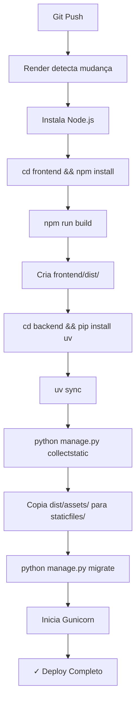

# 🚀 Deploy Unificado - Mapa do Bosque

Este guia explica como funciona o **deploy unificado** onde o Frontend React e Backend Django rodam **na mesma porta** e **mesmo domínio**.

## 📐 Arquitetura

```
┌─────────────────────────────────────────┐
│   https://mapa-do-bosque.onrender.com   │
│                                          │
│  ┌────────────────────────────────────┐ │
│  │     Django (Gunicorn) - Porta X    │ │
│  │                                     │ │
│  │  GET /           → index.html      │ │
│  │  GET /login      → index.html      │ │
│  │  GET /dashboard  → index.html      │ │
│  │  GET /api/*      → Django API      │ │
│  │  GET /admin/     → Django Admin    │ │
│  │  GET /assets/*   → Static Files    │ │
│  │                  (JS, CSS, imgs)    │ │
│  └────────────────────────────────────┘ │
└─────────────────────────────────────────┘
```

**Como funciona:**
1. Usuário acessa `https://mapa-do-bosque.onrender.com/` → Django serve `index.html` do React
2. React carrega e assume o roteamento no browser
3. Quando React precisa de dados, faz request para `/api/*` → Django processa e retorna JSON
4. Tudo funciona na **mesma origem** (same-origin), sem necessidade de CORS

## ✅ Vantagens

- ✅ **Apenas 1 serviço no Render** (mais barato)
- ✅ **Sem CORS** (mesma origem)
- ✅ **Deploy simplificado** (1 único comando)
- ✅ **SSL automático** para tudo
- ✅ **Redirecionamento automático** do frontend

## 🔧 Como Testar Localmente

### Opção 1: Desenvolvimento Separado (Recomendado para dev)

```bash
# Terminal 1 - Backend
cd backend
source venv/bin/activate
python manage.py runserver
# Roda em http://localhost:8000

# Terminal 2 - Frontend
cd frontend
npm run dev
# Roda em http://localhost:5173
```

Neste modo:
- Frontend acessa API via `http://localhost:8000/api` (configurado no `.env`)
- CORS está ativado no Django

### Opção 2: Simulando Produção (Unificado)

```bash
# 1. Build do Frontend
cd frontend
npm run build
# Cria pasta dist/ com arquivos estáticos

# 2. Rodar apenas o Backend (que serve o frontend também)
cd ../backend
source venv/bin/activate
python manage.py collectstatic --no-input
python manage.py runserver

# Acesse: http://localhost:8000
# - / → React App
# - /api/ → Django API
# - /admin/ → Django Admin
```

Neste modo:
- Tudo funciona como em produção
- Frontend acessa API via `/api` (caminho relativo)
- Sem necessidade de CORS

## 🌐 Deploy no Render

### Passo 1: Commit e Push

```bash
git add .
git commit -m "feat: Deploy unificado Frontend + Backend"
git push origin main
```

### Passo 2: Criar Blueprint no Render

1. Acesse [dashboard.render.com](https://dashboard.render.com)
2. Clique em **"New +"** → **"Blueprint"**
3. Conecte seu repositório GitHub
4. O Render detectará o `render.yaml` automaticamente
5. Configure as variáveis de ambiente:
   - `DATABASE_URL`: Sua connection string do Supabase
   - `EMAIL_HOST_USER`: Seu email para envio
   - `EMAIL_HOST_PASSWORD`: Senha de app do email

### Passo 3: Deploy

Clique em **"Apply"** e aguarde:

1. ✅ Instalação do Node.js
2. ✅ Build do Frontend (`npm run build`)
3. ✅ Instalação das dependências do Backend (`uv sync`)
4. ✅ Collect static files (inclui assets do React)
5. ✅ Migrations do Django
6. ✅ Start do Gunicorn

**Tempo estimado:** 5-8 minutos

### Passo 4: Verificar

Acesse `https://mapa-do-bosque.onrender.com/`:
- ✅ Deve carregar o frontend React
- ✅ Login deve funcionar (API em `/api/login/`)
- ✅ Dashboard deve carregar dados (API em `/api/wbr/`)

## 🔍 Como Funciona o Roteamento

### Django URLs (`backend/mapaconfig/urls.py`)

```python
urlpatterns = [
    path('admin/', ...),           # Django Admin
    path('api/', ...),              # API REST
    path('api/wbr/', ...),          # WBR Analytics
    re_path(r'^.*$', ReactAppView)  # Catch-all: Serve index.html
]
```

**Ordem importa!** As rotas específicas (`/api/`, `/admin/`) vêm **antes** do catch-all.

### React Router

O React Router funciona normalmente no browser:
```typescript
<Route path="/" element={<Home />} />
<Route path="/login" element={<Login />} />
<Route path="/dashboard" element={<Dashboard />} />
```

Quando o usuário navega:
1. Primeira carga: Django serve `index.html`
2. React Router assume o controle
3. Navegações subsequentes: React Router (sem reload)

## 🛠️ Estrutura de Arquivos

```
mapa-do-bosque-2/
├── backend/
│   ├── mapaconfig/
│   │   ├── settings.py       # Configuração de STATIC_URL, STATICFILES_DIRS
│   │   ├── urls.py            # Roteamento com catch-all
│   │   └── views.py           # ReactAppView que serve index.html
│   ├── staticfiles/           # Gerado por collectstatic (inclui React build)
│   └── ...
├── frontend/
│   ├── dist/                  # Build do React (criado por npm run build)
│   │   ├── index.html
│   │   └── assets/
│   │       ├── index-abc123.js
│   │       └── index-abc123.css
│   ├── .env                   # Desenvolvimento: http://localhost:8000/api
│   └── .env.production        # Produção: /api (caminho relativo)
└── render.yaml                # Blueprint unificado
```

## 📊 Fluxo de Build no Render



## 🐛 Troubleshooting

### Erro: "index.html not found"

**Causa:** Frontend não foi buildado

**Solução:**
```bash
cd frontend
npm run build
cd ../backend
python manage.py collectstatic --no-input
```

### Erro: "404 em /api/..."

**Causa:** Rotas da API não estão registradas corretamente

**Solução:** Verifique `backend/mapaconfig/urls.py` - rotas da API devem vir **antes** do catch-all

### Frontend carrega mas API não funciona

**Causa:** `VITE_API_URL` incorreto

**Solução:**
- **Produção:** Deve ser `/api` (em `.env.production`)
- **Dev:** Deve ser `http://localhost:8000/api` (em `.env`)

### Assets 404 (JS/CSS não carregam)

**Causa:** `collectstatic` não rodou ou `STATICFILES_DIRS` incorreto

**Solução:**
```bash
# Verificar se dist existe
ls -la frontend/dist/

# Verificar se assets existem
ls -la frontend/dist/assets/

# Rodar collectstatic
cd backend
python manage.py collectstatic --no-input

# Verificar se assets foram copiados
ls -la backend/staticfiles/
```

## 🔄 Atualizando o Deploy

Qualquer `git push` para a branch `main` dispara deploy automático:

```bash
git add .
git commit -m "feat: Nova funcionalidade"
git push origin main
```

O Render automaticamente:
1. ✅ Faz pull das mudanças
2. ✅ Rebuilda frontend e backend
3. ✅ Redeploy
4. ✅ Zero downtime (rolling deploy)

## 📝 Checklist Final

Antes de fazer deploy:

- [ ] Frontend builda sem erros: `cd frontend && npm run build`
- [ ] Backend roda localmente: `cd backend && python manage.py runserver`
- [ ] Migrations aplicadas: `python manage.py migrate`
- [ ] `.env.production` configurado com `VITE_API_URL=/api`
- [ ] `render.yaml` atualizado com buildCommand correto
- [ ] Variáveis de ambiente configuradas no Render:
  - [ ] `DATABASE_URL`
  - [ ] `EMAIL_HOST_USER`
  - [ ] `EMAIL_HOST_PASSWORD`
  - [ ] `SECRET_KEY` (auto-gerado)

## 🎉 Pronto!

Agora seu sistema roda em um único Web Service no Render:
- ✅ Frontend React servido pelo Django
- ✅ Backend Django API em `/api/`
- ✅ Tudo na mesma porta e domínio
- ✅ Sem necessidade de CORS
- ✅ Deploy simplificado

**URL de produção:** `https://mapa-do-bosque.onrender.com`

---

**Desenvolvido pelo Time de Digitalização do Grupo JCC** 🚀
