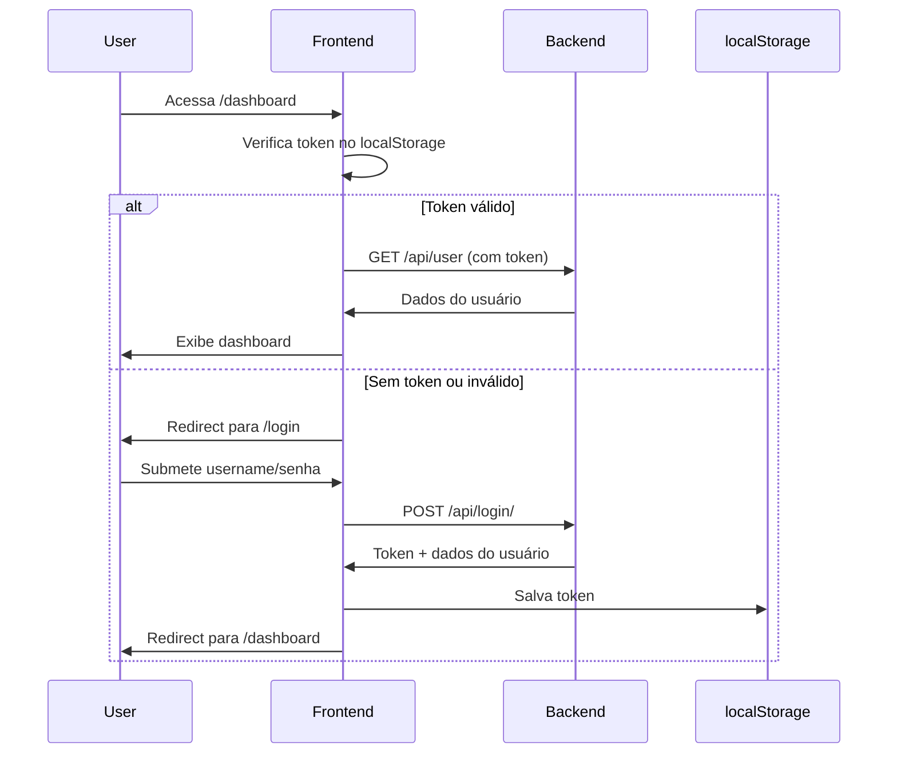

# Mapa do Bosque - Frontend

Aplicação React desenvolvida com TypeScript e Vite para visualização de KPIs e métricas dos shoppings do Grupo JCC. Interface moderna e responsiva para análise de dados operacionais e de redes sociais.

## 📋 Sobre o Projeto

O frontend do Mapa do Bosque é uma Single Page Application (SPA) que centraliza a visualização de KPIs dos três shoppings do Grupo JCC: Iguatemi Fortaleza, North Shopping Jóquei e North Shopping Maracanaú. Desenvolvido pelo time de Digitalização, oferece dashboards interativos com gráficos WBR (Week-Based Reporting), análises de Instagram e filtros avançados.

## 🎯 Funcionalidades

### Sistema de Autenticação
- **Landing Page**: Página inicial com vídeo institucional do Grupo JCC
- **Login**: Autenticação com token via API REST
- **Cadastro**: Registro de novos usuários com validação corporativa
- **Logout**: Encerramento seguro de sessão
- **Recuperação de Senha**: Sistema de reset com código de 6 dígitos
- **Rotas Protegidas**: Acesso restrito aos dashboards para usuários autenticados

### Painel de Operações
- **KPIs em Tempo Real**: Cards com métricas principais (vendas, ticket médio, lojas ativas, conversão)
- **Gráficos WBR**: Comparativo semanal e mensal entre ano atual e ano anterior
- **Filtros Avançados**: Por data, shopping, ramo, categoria e loja específica
- **Sidebar Retrátil**: Interface adaptável para maximizar área de visualização
- **Navegação Rápida**: Acesso direto ao painel do Instagram

### Painel do Instagram
- **Métricas de Engajamento**: Curtidas, comentários, compartilhamentos, salvamentos
- **Análise de Alcance**: Impressões, contas alcançadas, taxa de engajamento
- **Filtros Personalizados**: Por período, tipo de post e shopping
- **Visualizações Interativas**: Gráficos e cards para análise visual

### Design e UX
- **Interface Moderna**: Design system baseado em Tailwind CSS + shadcn/ui
- **Tema Corporativo**: Cores personalizadas do Grupo JCC (amarelo #FFED00)
- **Responsividade**: Layout adaptável para desktop, tablet e mobile
- **Componentes Reutilizáveis**: Biblioteca de componentes UI padronizados
- **Animações Suaves**: Transições e hover states para melhor experiência

## 🏗️ Arquitetura

### Estrutura de Pastas

```
frontend/
├── src/
│   ├── assets/                    # Recursos estáticos
│   │   ├── Grupo JCC.svg         # Logo do Grupo JCC
│   │   └── Vídeo Institucional.mp4  # Vídeo da landing page
│   ├── components/                # Componentes React
│   │   ├── ui/                   # Componentes base (shadcn/ui)
│   │   │   ├── button.tsx
│   │   │   ├── card.tsx
│   │   │   ├── input.tsx
│   │   │   ├── label.tsx
│   │   │   └── select.tsx
│   │   ├── auth/                 # Componentes de autenticação
│   │   │   └── ProtectedRoute.tsx
│   │   └── features/             # Componentes de funcionalidades
│   │       ├── FilterSidebar.tsx
│   │       ├── InstagramFilterSidebar.tsx
│   │       └── WBRChart.tsx
│   ├── contexts/                  # Context API
│   │   └── AuthContext.tsx       # Estado global de autenticação
│   ├── pages/                     # Páginas da aplicação
│   │   ├── Home.tsx              # Landing page
│   │   ├── Login.tsx             # Tela de login
│   │   ├── Cadastro.tsx          # Tela de cadastro
│   │   ├── OperationsPanel.tsx   # Dashboard de operações
│   │   └── InstagramPanel.tsx    # Dashboard do Instagram
│   ├── services/                  # Serviços externos
│   │   └── api.ts                # Cliente HTTP para API REST
│   ├── types/                     # Definições TypeScript
│   │   ├── auth.types.ts         # Tipos de autenticação
│   │   └── wbr.types.ts          # Tipos de gráficos WBR
│   ├── lib/                       # Utilitários
│   │   └── utils.ts              # Funções auxiliares
│   ├── App.tsx                    # Componente raiz
│   ├── main.tsx                   # Entry point
│   └── index.css                  # Estilos globais
├── public/                        # Arquivos públicos
│   └── jcc.svg                   # Favicon
├── .env                           # Variáveis de ambiente
├── index.html                     # HTML base
├── package.json                   # Dependências npm
├── tsconfig.json                  # Configuração TypeScript
├── vite.config.ts                # Configuração Vite
├── tailwind.config.js            # Configuração Tailwind CSS
├── Dockerfile                     # Imagem Docker
└── README.md                      # Este arquivo
```

### Stack Tecnológico

- **React 18**: Biblioteca para construção de interfaces
- **TypeScript**: Superset JavaScript com tipagem estática
- **Vite**: Build tool moderna e rápida
- **React Router**: Roteamento client-side (v7)
- **Tailwind CSS**: Framework CSS utility-first
- **shadcn/ui**: Biblioteca de componentes acessíveis
- **Recharts**: Biblioteca para gráficos interativos
- **Axios**: Cliente HTTP para requisições à API
- **date-fns**: Manipulação de datas em JavaScript

### Context API - AuthContext

Sistema de gerenciamento de autenticação global:

```typescript
interface AuthContextType {
  user: User | null;              // Dados do usuário logado
  token: string | null;           // Token JWT
  isAuthenticated: boolean;       // Status de autenticação
  login: (username, password) => Promise<void>;
  logout: () => Promise<void>;
  cadastro: (dados) => Promise<void>;
}
```

**Funcionalidades:**
- Persistência de token no localStorage
- Configuração automática de headers HTTP
- Redirecionamento automático após login/logout
- Estado global acessível via hook `useAuth()`

### Serviço de API

Cliente HTTP configurado para comunicação com o backend:

```typescript
class ApiService {
  private api: AxiosInstance;

  // Endpoints de autenticação
  async login(data: LoginRequest): Promise<LoginResponse>
  async logout(): Promise<void>
  async cadastro(data: CadastroRequest): Promise<CadastroResponse>

  // Configuração dinâmica de token
  setAuthToken(token: string | null): void
}
```

**Configuração:**
- Base URL configurável via `VITE_API_URL`
- Interceptors para adicionar token em todas as requisições
- Tratamento de erros centralizado

## 📄 Páginas

### 1. Home (Landing Page)

**Rota:** `/`

**Descrição:** Página inicial com vídeo institucional em tela cheia e apresentação do projeto.

**Componentes:**
- Vídeo de fundo em loop (54MB, autoplay)
- Overlay com gradiente escuro
- Logo do Grupo JCC (SVG)
- Título e subtítulo com text-shadow
- Botão CTA "Acessar Sistema" (amarelo #FFED00)
- Seção scrollável "Sobre o Mapa do Bosque"
- 3 cards de benefícios (Dados Centralizados, Insights Estratégicos, Digitalização)

**Recursos:**
- Vídeo carrega com fade-in suave
- Scroll infinito com sticky video background
- Design responsivo para mobile/tablet/desktop

---

### 2. Login

**Rota:** `/login`

**Descrição:** Tela de autenticação com formulário username/senha.

**Campos:**
- Username (campo de texto)
- Senha (campo password)
- Botão "Entrar" (submit)
- Link "Não tem conta? Cadastre-se"
- Link "Esqueceu a senha?"

**Validações:**
- Campos obrigatórios
- Feedback visual de erros (border vermelho + mensagem)
- Loading state durante requisição
- Redirecionamento para /dashboard após sucesso

**Tratamento de Erros:**
- 401: "Credenciais inválidas"
- 500: "Erro no servidor"
- Network: "Erro de conexão"

---

### 3. Cadastro

**Rota:** `/cadastro`

**Descrição:** Formulário de registro de novo usuário.

**Campos:**
- Nome (first_name)
- Sobrenome (last_name)
- Email (validação de domínio)
- Username (gerado automaticamente, readonly)
- Senha (mínimo 8 caracteres)
- Confirmar Senha
- Cargo (select com 10 opções)
- Setor (texto livre)
- Botão "Cadastrar"
- Link "Já tem conta? Faça login"

**Validações:**
- Email deve ser @jccbr.com, @iguatemifortaleza.com.br, etc.
- Senhas devem ser iguais
- Username gerado remove acentos e usa lowercase
- Feedback em tempo real

**Exemplo de Username:**
- João Silva → joao.silva
- Maria José → maria.jose

---

### 4. OperationsPanel (Painel de Operações)

**Rota:** `/dashboard` (protegida)

**Descrição:** Dashboard principal com KPIs de operações dos shoppings.

**Componentes:**

#### Header
- Título "Painel de Operações"
- Subtítulo dinâmico mostrando filtro ativo
- Botão "Instagram" (navega para /instagram)
- Botão "Sair" (logout)

#### KPI Cards (4 cards responsivos)
1. **Vendas Totais**: R$ 1.234.567 (+12.5% verde)
2. **Ticket Médio**: R$ 287,50 (+5.2% verde)
3. **Lojas Ativas**: 156 (+3 verde)
4. **Taxa de Conversão**: 68% (-2.1% vermelho)

**Features:**
- Hover effect (translate-y + shadow)
- Cores dinâmicas (verde para positivo, vermelho para negativo)
- Grid responsivo (1 coluna mobile, 2 tablet, 4 desktop)

#### Gráfico WBR (Full Width)
Gráfico de barras comparativo semanal/mensal:

**Dados Exibidos:**
- Semanas do ano atual (CY) vs ano anterior (PY)
- Meses do ano atual (CY) vs ano anterior (PY)
- Valores em R$ formatados
- Marcação de períodos parciais

**Interações:**
- Toggle entre visão semanal/mensal
- Hover mostra valores exatos
- Cores: azul (ano atual), cinza (ano anterior)
- Legenda interativa

**Implementação:**
- Biblioteca: Recharts
- Tipo: BarChart com barras agrupadas
- Tooltip customizado com formatação de moeda
- Responsivo com overflow-x scroll em mobile

#### FilterSidebar (Retrátil)
Barra lateral com filtros:

**Campos:**
- Data (date picker)
- Shopping (select: Iguatemi, North Jóquei, North Maracanaú, Todos)
- Ramo (select dinâmico)
- Categoria (select dinâmico)
- Loja (select dinâmico)
- Botão "Aplicar Filtros"
- Botão "Limpar Filtros"

**Estados:**
- Expandida: 280px de largura
- Colapsada: 60px (só ícones)
- Transição suave (transition-all duration-300)
- Toggle via botão hamburger

#### Charts Grid (2 colunas em desktop)
4 placeholders para gráficos futuros:
- Distribuição por Shopping
- Top 10 Lojas
- Performance por Categoria
- Ticket Médio por Período

**Status:** "Gráfico em desenvolvimento" (mockup)

---

### 5. InstagramPanel (Painel do Instagram)

**Rota:** `/instagram` (protegida)

**Descrição:** Dashboard com métricas de engajamento das redes sociais.

**Componentes:**

#### Header
- Título "Analytics do Instagram"
- Subtítulo com período selecionado
- Botão "Operações" (volta para /dashboard)
- Botão "Sair" (logout)

#### KPI Cards do Instagram (6 cards)
1. **Curtidas**: 45.3K (+8.2%)
2. **Comentários**: 1.2K (+15.5%)
3. **Compartilhamentos**: 3.4K (+12.0%)
4. **Salvamentos**: 2.1K (+20.3%)
5. **Impressões**: 120K (+5.8%)
6. **Alcance**: 89K (+7.4%)

**Features:**
- Grid 3 colunas (desktop), 2 (tablet), 1 (mobile)
- Ícones do Instagram
- Valores formatados (K para milhares)
- Variação percentual colorida

#### InstagramFilterSidebar
Filtros específicos para Instagram:

**Campos:**
- Período (últimos 7 dias, 30 dias, 90 dias, personalizado)
- Shopping (multi-select)
- Tipo de Post (foto, vídeo, carrossel, reels, stories)
- Ordenar Por (mais curtidas, mais comentários, mais recente)

#### Gráficos do Instagram
Visualizações de métricas:
- Evolução de seguidores (line chart)
- Engajamento por tipo de post (bar chart)
- Melhores horários de postagem (heatmap)
- Top posts (grid de imagens)

**Status:** Alguns gráficos ainda em desenvolvimento (dados mockados)

---

## 🔐 Sistema de Autenticação

### Fluxo de Autenticação



### ProtectedRoute Component

Componente HOC (Higher-Order Component) para proteção de rotas:

```typescript
export function ProtectedRoute({ children }: { children: React.ReactNode }) {
  const { isAuthenticated } = useAuth();
  const location = useLocation();

  if (!isAuthenticated) {
    return <Navigate to="/login" state={{ from: location }} replace />;
  }

  return <>{children}</>;
}
```

**Uso:**
```tsx
<Route path="/dashboard" element={
  <ProtectedRoute>
    <OperationsPanel />
  </ProtectedRoute>
} />
```

### Persistência de Sessão

- Token salvo em `localStorage.getItem('token')`
- Carregamento automático no mount do AuthProvider
- Limpeza no logout
- Expiração tratada pelo backend (token invalidado)

---

## 🎨 Design System

### Paleta de Cores

```css
:root {
  --primary: 60 100% 50%;        /* #FFED00 - Amarelo Grupo JCC */
  --primary-foreground: 0 0% 9%; /* #171717 - Texto sobre amarelo */
  --background: 0 0% 100%;       /* #FFFFFF - Fundo branco */
  --foreground: 0 0% 9%;         /* #171717 - Texto principal */
  --muted: 0 0% 96%;            /* #F5F5F5 - Fundo secundário */
  --card: 0 0% 100%;            /* #FFFFFF - Cards */
  --border: 0 0% 89%;           /* #E5E5E5 - Bordas */
}
```

### Tipografia

- **Font Family**: Inter (via Google Fonts)
- **Títulos**: font-bold, text-3xl (h1), text-2xl (h2)
- **Corpo**: text-base (16px), line-height 1.5
- **Labels**: text-sm, font-semibold, uppercase

### Componentes shadcn/ui

Biblioteca de componentes acessíveis e customizáveis:

**Instalados:**
- Button: Variantes default, outline, ghost
- Card: CardHeader, CardTitle, CardContent
- Input: Text, password, email, date
- Label: Labels para formulários
- Select: Dropdowns com busca

**Customização:**
- Todos os componentes aceitam className
- Integração nativa com Tailwind CSS
- Variantes de tamanho (sm, md, lg)
- Estados hover, focus, disabled

---

## 🚀 Instalação e Execução

### Pré-requisitos

- Node.js 18+ (LTS recomendado)
- npm ou yarn
- Backend rodando (ver backend/README.md)

### Passo a Passo

1. **Clone o repositório:**
```bash
git clone <url-do-repositorio>
cd mapa-do-bosque-2/frontend
```

2. **Instale as dependências:**
```bash
npm install

# Ou com yarn:
yarn install
```

3. **Configure as variáveis de ambiente:**

Crie um arquivo `.env` na raiz do frontend:

```env
# URL da API Backend
VITE_API_URL=http://localhost:8000/api

# Para produção com ngrok:
# VITE_API_URL=https://seu-ngrok-id.ngrok-free.app/api
```

4. **Inicie o servidor de desenvolvimento:**
```bash
npm run dev

# Ou com yarn:
yarn dev
```

5. **Acesse a aplicação:**
```
http://localhost:5173
```

### Scripts Disponíveis

```json
{
  "dev": "vite",                    // Servidor de desenvolvimento
  "build": "tsc && vite build",     // Build para produção
  "lint": "eslint .",               // Linter de código
  "preview": "vite preview"         // Preview do build
}
```

---

## 🐳 Docker

### Executar com Docker Compose

O projeto inclui configuração Docker para facilitar o deployment:

```bash
# Na raiz do projeto (não dentro de /frontend)
docker-compose up -d
```

Isso iniciará:
- **Backend** na porta 8000
- **Frontend** na porta 5173
- **Ngrok** expondo ambos publicamente

### Dockerfile

```dockerfile
FROM node:18-alpine
WORKDIR /app
COPY package*.json ./
RUN npm install
COPY . .
EXPOSE 5173
CMD ["npm", "run", "dev", "--", "--host"]
```

### Acessar logs:
```bash
docker-compose logs -f frontend
```

### Rebuild após mudanças:
```bash
docker-compose up -d --build frontend
```

---

## 🧪 Desenvolvimento

### Adicionar Nova Página

1. **Crie o componente em** `src/pages/`:
```tsx
// src/pages/NovaPage.tsx
export function NovaPage() {
  return <div>Nova Página</div>;
}
```

2. **Adicione a rota em** `App.tsx`:
```tsx
<Route path="/nova" element={<NovaPage />} />
```

3. **Se precisar de proteção:**
```tsx
<Route path="/nova" element={
  <ProtectedRoute>
    <NovaPage />
  </ProtectedRoute>
} />
```

### Adicionar Novo Componente UI

Usando shadcn/ui CLI:

```bash
npx shadcn@latest add button
npx shadcn@latest add card
npx shadcn@latest add input
```

Isso instalará automaticamente o componente em `src/components/ui/`.

### Trabalhar com TypeScript

**Definir tipos:**
```typescript
// src/types/meu-tipo.types.ts
export interface MeuTipo {
  id: number;
  nome: string;
  ativo: boolean;
}
```

**Usar tipos:**
```typescript
import { MeuTipo } from '@/types/meu-tipo.types';

const item: MeuTipo = {
  id: 1,
  nome: "Exemplo",
  ativo: true
};
```

### Chamadas à API

```typescript
import { apiService } from '@/services/api';

// Em um componente:
const fetchData = async () => {
  try {
    const response = await apiService.get('/endpoint');
    console.log(response.data);
  } catch (error) {
    console.error('Erro:', error);
  }
};
```

---

## 📊 Dados Mockados

Atualmente o frontend usa dados mockados para desenvolvimento. Os dados reais virão da API quando os endpoints estiverem prontos.

### Geração de Dados WBR

```typescript
// Dados mockados em OperationsPanel.tsx
const gerarDadosMocadosWBR = (): WBRData => {
  // Gera 8 semanas e 12 meses de dados
  // Valores aleatórios com tendência de crescimento
  // Comparativo entre ano atual (CY) e anterior (PY)
  return {
    semanas_cy: { ... },
    semanas_py: { ... },
    meses_cy: { ... },
    meses_py: { ... },
    ano_atual: 2025,
    ano_anterior: 2024,
  };
};
```

### Dados de KPIs

```typescript
const kpiData = [
  {
    title: 'Vendas Totais',
    value: 'R$ 1.234.567',
    change: '+12.5%',
    positive: true
  },
  // ... mais KPIs
];
```

**Próximo passo:** Integrar com endpoints reais quando disponíveis.

---

## 🔧 Configurações

### Vite Config

```typescript
// vite.config.ts
export default defineConfig({
  plugins: [react()],
  resolve: {
    alias: {
      '@': path.resolve(__dirname, './src'), // Import alias
    },
  },
  server: {
    host: true, // Necessário para Docker
    port: 5173,
  },
});
```

### Tailwind Config

```javascript
// tailwind.config.js
module.exports = {
  content: [
    "./index.html",
    "./src/**/*.{js,ts,jsx,tsx}",
  ],
  theme: {
    extend: {
      colors: {
        primary: 'hsl(var(--primary))',
        secondary: 'hsl(var(--secondary))',
        // ... mais cores
      },
    },
  },
  plugins: [require("tailwindcss-animate")],
};
```

### TypeScript Config

```json
{
  "compilerOptions": {
    "target": "ES2020",
    "module": "ESNext",
    "jsx": "react-jsx",
    "strict": true,
    "baseUrl": ".",
    "paths": {
      "@/*": ["./src/*"]
    }
  }
}
```

---

## 📱 Responsividade

O frontend é totalmente responsivo com breakpoints Tailwind:

- **Mobile**: < 640px (sm)
- **Tablet**: 640px - 1024px (md-lg)
- **Desktop**: > 1024px (xl)

**Exemplos de uso:**
```tsx
<div className="grid grid-cols-1 md:grid-cols-2 lg:grid-cols-4 gap-6">
  {/* 1 coluna mobile, 2 tablet, 4 desktop */}
</div>
```

---

## 🚀 Build para Produção

### Gerar build otimizado:

```bash
npm run build
```

Isso criará uma pasta `dist/` com:
- HTML, CSS e JS minificados
- Assets otimizados
- Source maps (opcional)
- Chunks separados para code splitting

### Testar build localmente:

```bash
npm run preview
```

Acesse: `http://localhost:4173`

### Deploy

O build pode ser servido por qualquer servidor estático:
- Nginx
- Apache
- Vercel
- Netlify
- AWS S3 + CloudFront

**Exemplo Nginx:**
```nginx
server {
  listen 80;
  server_name mapadobosque.com;

  root /var/www/mapa-do-bosque/dist;
  index index.html;

  location / {
    try_files $uri $uri/ /index.html;
  }
}
```

---

## 🎯 Roadmap

### Curto Prazo
- [ ] Integrar dados reais dos endpoints de KPIs
- [ ] Implementar filtros funcionais (não apenas mockados)
- [ ] Adicionar gráficos de distribuição por shopping
- [ ] Implementar top 10 lojas com dados reais

### Médio Prazo
- [ ] Adicionar testes unitários (Vitest)
- [ ] Implementar testes E2E (Playwright)
- [ ] Adicionar dark mode
- [ ] Criar sistema de notificações

### Longo Prazo
- [ ] Exportação de relatórios em PDF/Excel
- [ ] Dashboard customizável (drag-and-drop)
- [ ] Integração com mais redes sociais (Facebook, TikTok)
- [ ] App mobile (React Native)

---

## 👥 Time de Desenvolvimento

Desenvolvido pelo **Time de Digitalização do Grupo JCC**

---

## 📄 Licença

Propriedade do Grupo JCC - Todos os direitos reservados

---

## 🆘 Suporte

Para dúvidas ou problemas:
1. Verifique a documentação do backend (backend/README.md)
2. Confira os logs do Docker: `docker-compose logs -f`
3. Entre em contato com o time de Digitalização

---

## 🔗 Links Úteis

- [React Documentation](https://react.dev)
- [Vite Documentation](https://vitejs.dev)
- [Tailwind CSS](https://tailwindcss.com)
- [shadcn/ui](https://ui.shadcn.com)
- [Recharts](https://recharts.org)
- [TypeScript Handbook](https://www.typescriptlang.org/docs)
